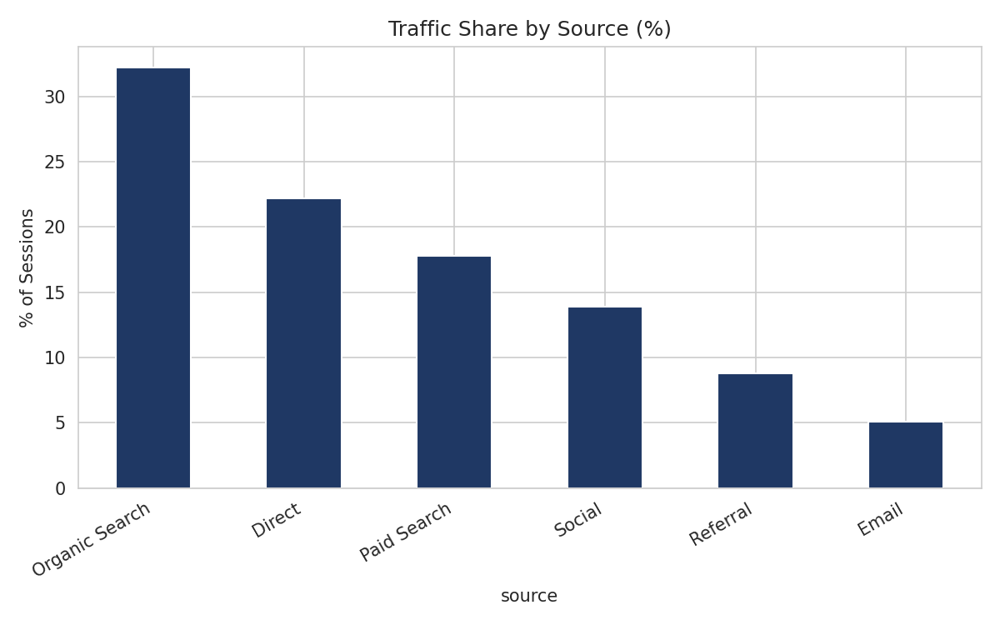
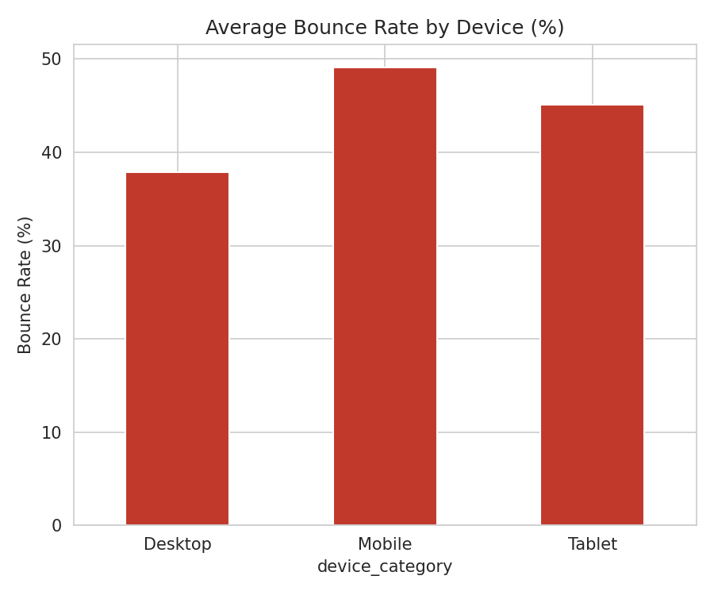

# 📊 Amazon Web Traffic Analysis

## 📌 Project Overview

This project analyzes Amazon website traffic data to understand traffic patterns, user behavior, engagement, and conversion performance. Python is used for data cleaning and exploratory analysis, SQL for business analysis, and Power BI for interactive dashboard development.

## 🎯 Business Objectives

- Analyze overall website traffic performance
- Identify the top traffic sources
- Compare new and returning users
- Analyze traffic by device category
- Evaluate conversion performance
- Analyze bounce rate across traffic sources
- Identify top-performing countries and pages
- Understand traffic patterns by hour and day of week
- Track website traffic trends over time

## 🛠️ Tools & Technologies

| Tool | Purpose |
|---|---|
| 🗄️ SQL (MySQL) | Data querying and business analysis |
| 🐍 Python | Data cleaning and exploratory analysis |
| 🐼 Pandas / NumPy | Data manipulation |
| 📈 Matplotlib / Seaborn | Data visualization |
| 📊 Power BI + DAX | Dashboard development |
| 📑 Jupyter Notebook | Interactive analysis |

## 📂 Dataset Information

**Source:** Synthetic dataset (42,815 sessions) generated to mirror the structure of a typical website traffic dataset. Generation logic: [`generate_data.py`](generate_data.py) — fully reproducible.

### Key Columns
Session ID, Timestamp, Country, Device Category, Source, Page Path, Avg Session Duration, Bounce Rate, Conversions, New/Returning User, Page Views, Unique Page Views.

## 🔄 Project Workflow

### 1. Data Cleaning
- Standardized inconsistent traffic-source text (casing/whitespace)
- Parsed timestamps, filled missing bounce rate / session duration / device category
- Removed duplicates
- Full code: [`amazon_traffic_eda.ipynb`](amazon_traffic_eda.ipynb)

### 2. SQL Analysis
Full query set: [`web_traffic_analysis.sql`](web_traffic_analysis.sql), including:
- Traffic source performance (window functions for % share)
- New vs returning user conversion comparison
- Device-level bounce rate
- Top 10 countries and pages (`RANK()`)
- Hour-of-day and day-of-week traffic patterns
- Monthly traffic trend with month-over-month growth (`LAG`)
- High-bounce / low-conversion source targeting (CTE)

### 3. Python EDA
Full notebook: [`amazon_traffic_eda.ipynb`](amazon_traffic_eda.ipynb)

### 4. Power BI Dashboard
Interactive dashboard (`Amazon Website Traffic Analysis.pbix`) with KPIs (Total Page Views, Conversions, Conversion Rate, New/Returning Users, Avg Bounce Rate), plus charts for traffic by source/device/country/page and time-based patterns.

## 📸 Dashboard Preview


## 💡 Key Insights

- **Organic Search** drives the largest share of traffic (~32%), but **Email** and **Direct** traffic convert at the highest rates
- **Social** traffic is high-volume but has the lowest conversion rate — a landing-page/targeting optimization opportunity
- **Mobile** has the highest bounce rate of all device categories





## 📌 Business Recommendations

- Focus marketing efforts on high-converting channels (Email, Direct) while optimizing Social campaigns
- Prioritize mobile UX improvements to reduce bounce rate
- Use peak traffic hours/days for targeted campaigns
- Prioritize high-traffic pages for conversion-rate optimization

## 📁 Project Structure

```
proj4_amazon_traffic/
├── data/
│   └── amazon_traffic_raw.csv
├── sql/
│   └── web_traffic_analysis.sql
├── python/
│   ├── generate_data.py
│   ├── amazon_traffic_eda.ipynb
│   └── save_screenshots.py
├── screenshots/
├── requirements.txt
└── README.md
```

## 🚀 Skills Demonstrated

SQL querying (window functions, CTEs, ranking) · data cleaning · exploratory data analysis · dashboard development (Power BI + DAX) · web-traffic/conversion analysis · business storytelling

## 🔮 Future Improvements

- Funnel analysis (landing → cart → checkout drop-off)
- A/B testing framework for landing page variants
- Predictive model for session-level conversion likelihood

## 👨‍💻 Yeshwanth Mocherla

**Yeshwanth Mocherla** — Aspiring Data Analyst | SQL | Python | Power BI
